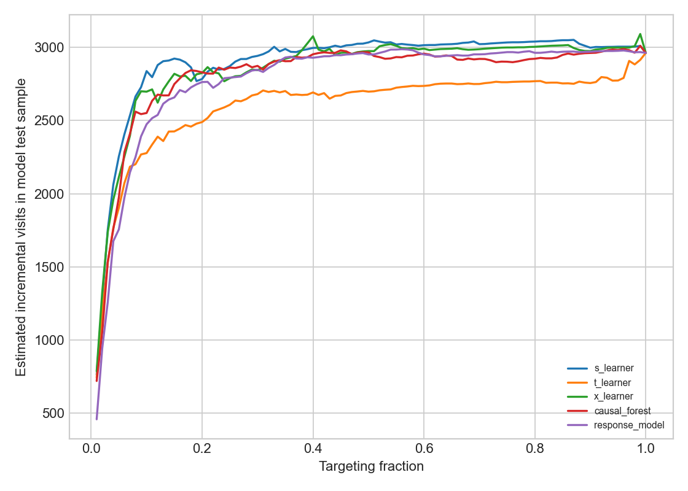
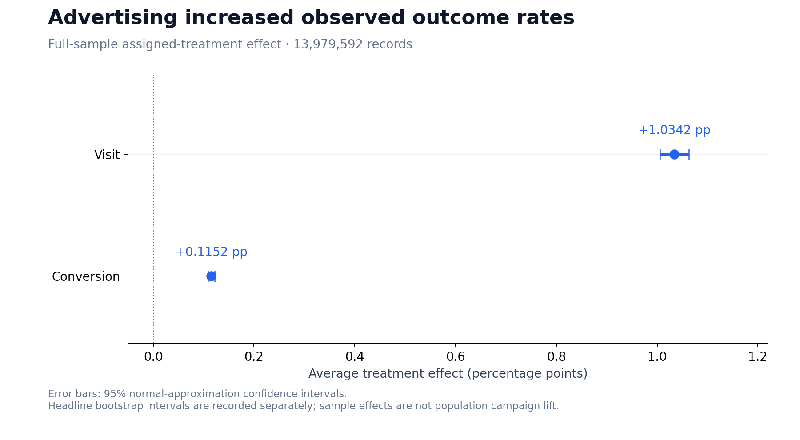
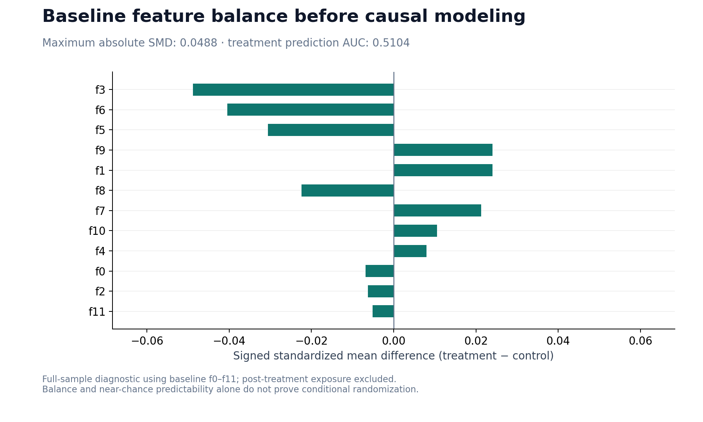

# Causal Advertising Uplift Experiment & Targeting Optimization

**Identify customers whose behavior can be changed by advertising, not just customers who are likely to visit.**

An independent, reproducible data science study on the corrected Criteo Uplift v2.1 randomized advertising dataset, connecting experimental validation, causal modeling, and budget-constrained audience prioritization.

**Python · DuckDB · LightGBM · EconML · Causal Forest · Uplift Modeling · A/B Testing**

## Results at a glance

| Question | Verified result |
| --- | --- |
| How much data was audited? | **13,979,592** experiment records |
| Did assigned advertising increase visits? | **+1.0342 percentage points** sample visit ATE |
| How uncertain is the estimate? | **[1.0060, 1.0623] percentage points**, 95% bootstrap CI |
| Which causal model was selected? | **LightGBM S-Learner**, selected by validation Qini |
| Top-10% causal targeting | **9.4848%** propensity-adjusted visit uplift |
| Top-10% response baseline | **8.2700%** propensity-adjusted visit uplift |
| Observed difference | **+1.2148 percentage points** for causal targeting |

These are **offline randomized-test estimates**, not deployed campaign results. Publisher subsampling limits population-level interpretation, and no revenue/cost fields exist; no ROI is claimed.

## Business problem

A response model asks **“Who is likely to visit?”** A causal model asks **“Whose probability of visiting changes because of advertising?”** Under a limited targeting budget, these rankings can lead to different audience choices. This project tests that distinction rather than assuming high response probability equals high incremental value.

## Analysis workflow

```text
Criteo v2.1 → checksum verification → DuckDB full-data audit
                                             │
                         ┌───────────────────┴───────────────────┐
                         ↓                                       ↓
               Full-sample ATE + CI                  Fixed hash sample + split
                                                                 ↓
                                          S/T/X-Learners + Causal Forest
                                                                 ↓
                                          Validation Qini model selection
                                                                 ↓
                                          Frozen test targeting comparison
```

## Visual evidence

### Incremental targeting versus response prediction

Estimated cumulative incremental visits as the targeting fraction increases, evaluated on the held-out model test partition. These are not production forecasts.



### Average effect and uncertainty

Visit is the primary modeling outcome; conversion is secondary. This chart uses **normal-approximation** confidence intervals. The headline interval above is the separately recorded bootstrap estimate.



### Assignment balance

Baseline feature balance is checked before causal modeling. Balance and treatment predictability diagnostics complement the experiment design evidence; neither alone proves conditional randomization.



Browse [all eight result charts](figures/) and the [complete model comparison](reports/uplift_evaluation.md).

For a concise explanation of the project, read the [interview guide](docs/interview-guide.md), including metric interpretation, method choices, and claims to avoid.

For calculation details, read the [methodology guide](docs/methodology.md): split rules, metric formulas, rounding conventions, and the distinction between ATE and decile bootstrap intervals.

## Verified scope

- Official Criteo organization mirror archive: 311,422,618 bytes; SHA256 `2716e1bf0fd157a93b5bf86924d9088419dfbac2022c6cd90030220634f616dc`.
- Full-data audit and ATE: 13,979,592 rows, 12 anonymized baseline features, treatment, visit, conversion and post-treatment exposure.
- Model sample: deterministic 1-in-7 hash sample, 1,397,678 train / 299,325 validation / 299,251 test rows.
- Models actually trained: LightGBM S-Learner, T-Learner, X-Learner, response model; EconML CausalForestDML on a deterministic 250,000-row training subset.
- Every baseline model feature is one of `f0`–`f11`. `exposure` is excluded because it is post-treatment.

## Detailed findings

- Treatment/control rows: 11,889,655 / 2,089,937; treatment ratio 85.0501%.
- Visit ATE: 1.0342 percentage points; 95% bootstrap CI [1.0060, 1.0623] percentage points.
- Conversion ATE: 0.1152 percentage points; 95% bootstrap CI [0.1083, 0.1222] percentage points.
- Baseline-feature treatment prediction validation AUC: 0.510361; maximum full-data absolute SMD: 0.048836.
- Validation Qini selected S-Learner. Test Qini / AUUC / visit uplift@10%: 0.00468973 / 0.00963994 / 9.4848%.
- Response-model test Qini / AUUC / visit uplift@10%: 0.00431221 / 0.00926242 / 8.2700%.

The uplift metrics use a propensity-adjusted transformed outcome. Mathematical definitions are recorded in `reports/uplift_evaluation.md`. The dataset publisher non-uniformly subsampled the data, so the measured sample ATE is not presented as original-population campaign lift. No revenue/cost fields exist and no ROI is claimed.

## Reproduce

```powershell
python -m venv .venv
.\.venv\Scripts\python.exe -m pip install -r requirements.txt
.\.venv\Scripts\python.exe scripts\00_download_data.py
.\.venv\Scripts\python.exe scripts\01_prepare_and_audit.py
.\.venv\Scripts\python.exe scripts\02_train_and_evaluate.py
.\.venv\Scripts\python.exe scripts\03_finalize_and_verify.py
```

The recorded environment uses **Python 3.11** and pinned packages in [requirements.txt](requirements.txt). Run all four stages in order on a fresh clone. Downloading requires internet access; full-data processing and Causal Forest training are substantially heavier than the lightweight checks below.

Every stage preserves machine-readable reports. [experiment_manifest.json](experiment_manifest.json) records the data version, hashes, split/sample rules, features, seed, selected model and original model artifact provenance. Committed reports contain paths from the original run; the pipeline regenerates local paths and artifacts in a new checkout. Exact numerical reproducibility can depend on dependency versions and execution environment.

### macOS / Linux

```bash
python3 -m venv .venv
.venv/bin/python -m pip install -r requirements.txt
.venv/bin/python scripts/00_download_data.py
.venv/bin/python scripts/01_prepare_and_audit.py
.venv/bin/python scripts/02_train_and_evaluate.py
.venv/bin/python scripts/03_finalize_and_verify.py
```

### Lightweight checks (no data download or ML dependencies)

```bash
python scripts/05_snapshot_summary.py
python -m unittest discover -s tests -v
```

The summary command displays the recorded estimates, run date and limitations. Add `--json` for machine-readable output. It reads saved reports; it does not run a new experiment.

The checks validate curve arithmetic, Qini/AUUC integration, population and decile reconciliation, Power BI model-summary consistency, source checksums, figure headers, and local README links. They **do not** rerun training or independently establish causal validity. GitHub Actions runs the same checks on pushes and pull requests.

### Refresh the portfolio figures

After installing the pinned dependencies, run `python scripts/04_render_portfolio.py` to refresh the three charts embedded above from the committed JSON reports, without downloading data or retraining models. These figures use the same recorded estimates; original pipeline charts for the other five views remain unchanged.

### Read-only reproduction preflight

Use the Python interpreter from your installed environment:

```bash
python scripts/06_preflight.py --dependencies
python scripts/06_preflight.py --artifacts
```

The first command checks Python 3.11 and the installed versions of every requirement pin, without importing ML packages. The second streams SHA256 checks of the archive, Parquet and recorded model files in **this checkout**, never following the original machine's absolute report paths and never deserializing models. Both options can be combined. Failed checks return a nonzero exit code; no download, deletion, training or report modification occurs.

On a fresh clone, the artifact check will report missing files because data and trained models are deliberately excluded from Git. Run the four reproduction stages first to regenerate them. Checksums match the saved artifact snapshot; after a new training run, reports must be regenerated by the finalization stage. Passing preflight verifies file integrity and version pins, not prediction equality or causal validity. Missing native libraries or runtime import failures are still possible.

## Reports and figures

- [Experiment validation](reports/experiment_validation.md): sample ratio, outcomes, SMD, distribution checks and treatment predictability.
- [ATE analysis](reports/ate_analysis.md): full-data visit/conversion ATE and normal/bootstrap confidence intervals.
- [Uplift evaluation](reports/uplift_evaluation.md): Qini, AUUC, uplift@K, deciles, model comparison and definitions.
- [Targeting policy](reports/targeting_policy.md): response-vs-causal policies for visit and conversion.
- [Artifact audit](reports/artifact_audit.json): model/source integrity and environment versions.
- [Power BI inputs](reports/powerbi/): verified CSV inputs; no PBIX artifact is claimed.
- [Figures](figures/): eight result plots.
- [Pipeline scripts](scripts/): download, audit, train/evaluate, and finalize/verify stages.

## Limitations and next experiments

- Publisher subsampling means sample effects are not original-population campaign effects.
- Results use one fixed split and one model seed. The targeting gain is not presented as a statistically confirmed difference between policies.
- The approximately 85% / 15% treatment imbalance limits control-arm estimation precision.
- Conversion is a secondary evaluation of visit-trained rankings, not a separately optimized conversion policy.
- No financial fields or online deployment exist. Production use would require cost/value inputs, repeated-split uncertainty analysis, and prospective randomized validation.

## Data source and usage

Source: [Criteo AI Lab — Uplift Prediction Dataset](https://ailab.criteo.com/criteo-uplift-prediction-dataset/) and the [Criteo organization mirror](https://huggingface.co/datasets/criteo/criteo-uplift). The corrected 13.98M-row v2.1 release is used instead of the older approximately 25M-row release for which Criteo reports a leakage issue.

The downloaded mirror records a **CC BY-NC-SA 4.0** dataset license; review the publisher's terms before reuse. Raw/processed data, virtual environments, trained models, and temporary logs are excluded from Git. The dataset is not redistributed, and this README does not grant a separate code license.
